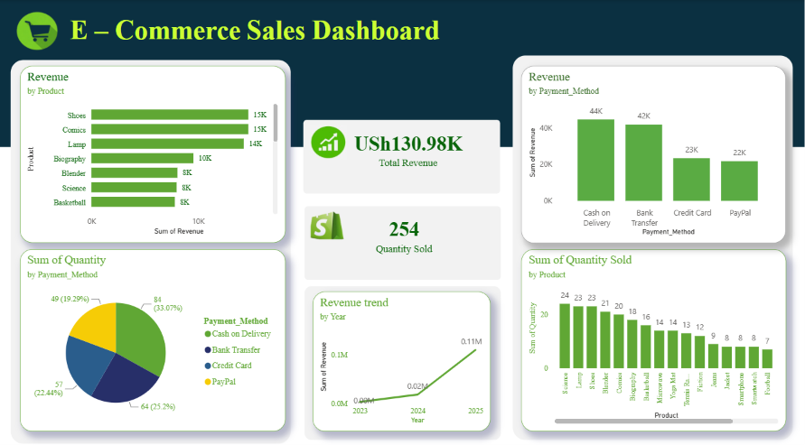

E-Commerce Sales Dashboard

📊 **Interactive analysis of e-commerce sales performance** covering revenue, quantity sold, payment methods, and yearly trends.

## 📌 Overview

This dashboard presents key sales metrics for an online store. The data reflects performance up to **2025**, with:

- **Total Revenue**: **USh 130.98K**
- **Total Quantity Sold**: **254 units**

## 📊 Key Insights

### 1. Top Revenue Generating Products
| Rank | Product       | Revenue |
|------|---------------|---------|
| 1    | Shoes         | 15K     |
| 1    | Comics        | 15K     |
| 3    | Lamp          | 14K     |
| 4    | Biography     | 10K     |
| 5    | Blender       | 8K      |
| 5    | Science       | 8K      |
| 5    | Basketball    | 8K      |

**Insight**: Shoes and Comics are the strongest performers.

### 2. Revenue by Payment Method

| Payment Method     | Revenue | Share    |
|--------------------|---------|----------|
| Cash on Delivery   | 44K     | 33.6%    |
| Bank Transfer      | 42K     | 32.1%    |
| Credit Card        | 23K     | 17.6%    |
| PayPal             | 22K     | 16.8%    |

**Insight**: Cash on Delivery and Bank Transfer dominate with **over 65%** of total revenue.

### 3. Quantity Sold by Payment Method

| Payment Method     | Quantity | Percentage |
|--------------------|----------|------------|
| Cash on Delivery   | 84       | 33.07%     |
| Bank Transfer      | 64       | 25.20%     |
| Credit Card        | 57       | 22.44%     |
| PayPal             | 49       | 19.29%     |

### 4. Quantity Sold by Product

**Top 10 Products by Volume:**
- Science: **24**
- Lamp: **23**
- Shoes: **23**
- Blender: **21**
- Comics: **20**
- Biography: **18**
- Basketball: **16**
- Microwave: **14**
- Yoga Mat: **14**
- Tennis Racket: **13**

### 5. Revenue Trend (2023 – 2025)

- **2023**: Very low
- **2024**: Moderate growth
- **2025**: Significant increase (**0.11M**)

**Key Observation**: Strong upward trend in 2025, indicating rapid business growth.

## 🚀 Business Recommendations

- Focus marketing efforts on **Shoes, Comics, and Lamp** — the top revenue drivers.
- Optimize for **Cash on Delivery** since it leads in both revenue and volume.
- Investigate ways to increase adoption of digital payments (Credit Card & PayPal).
- Capitalize on the 2025 growth momentum.

